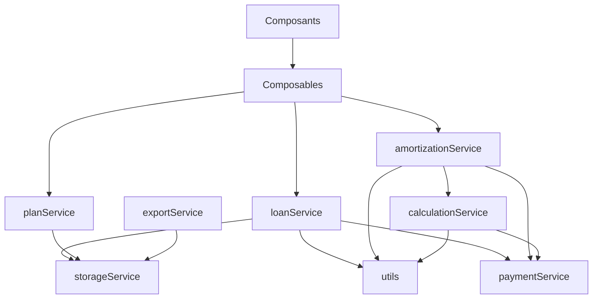

# Architecture des Services - Opti-Loan

```
┌─────────────────────────────────────────────────────────────────┐
│                        COMPOSANTS SVELTE                          │
│  (LoanForm, LoansList, FinancingPlanForm, AmortizationTable...)  │
└────────────────────────┬────────────────────────────────────────┘
                         │
                         │ Utilisent
                         ▼
┌─────────────────────────────────────────────────────────────────┐
│                         COMPOSABLES                               │
│  ┌──────────────┐  ┌──────────────┐  ┌──────────────┐          │
│  │  loanForm    │  │  loansList   │  │  plansList   │          │
│  │              │  │              │  │              │          │
│  │ - Store      │  │ - CRUD       │  │ - CRUD       │          │
│  │ - Validation │  │ - Sync       │  │ - Calc       │          │
│  └──────┬───────┘  └──────┬───────┘  └──────┬───────┘          │
└─────────┼──────────────────┼──────────────────┼──────────────────┘
          │                  │                  │
          │ Appellent        │                  │
          ▼                  ▼                  ▼
┌─────────────────────────────────────────────────────────────────┐
│                       SERVICES MÉTIER                             │
│  ┌─────────────┐  ┌──────────────┐  ┌──────────────┐           │
│  │ loanService │  │ planService  │  │exportService │           │
│  └─────┬───────┘  └──────┬───────┘  └──────┬───────┘           │
│        │                  │                  │                    │
│  ┌─────┴──────────┐  ┌───┴───────────┐  ┌──┴────────────┐      │
│  │calculationSvc  │  │amortization   │  │ paymentService│      │
│  └────────────────┘  │   Service     │  └───────────────┘      │
│                      └───────────────┘                           │
└────────────────────────┬────────────────────────────────────────┘
                         │
                         │ Dépendent de
                         ▼
┌─────────────────────────────────────────────────────────────────┐
│                    SERVICES FONDAMENTAUX                          │
│  ┌──────────────┐  ┌──────────────┐  ┌──────────────┐          │
│  │    utils     │  │storageService│  │    types     │          │
│  │              │  │              │  │              │          │
│  │ - Dates      │  │ - LocalStg   │  │ - Interfaces │          │
│  │ - Calculs    │  │ - Export     │  │ - Types      │          │
│  │ - Maths      │  │ - Import     │  │              │          │
│  └──────────────┘  └──────────────┘  └──────────────┘          │
└─────────────────────────────────────────────────────────────────┘
```

## Flux de Données

### 1. Création d'un Prêt

```
Composant (LoanForm.svelte)
    │
    ├─> loanFormStore (état local)
    │       │
    │       └─> validation automatique
    │
    └─> loansList.add()
            │
            └─> loanService.saveLoan()
                    │
                    └─> storageService.saveToStorage('LOANS')
                            │
                            └─> localStorage
```

### 2. Calcul d'Amortissement

```
Composant (AmortizationTable.svelte)
    │
    └─> planAmortizationStore.currentTable
            │
            ├─> calculatePlanAmortization()
            │       │
            │       ├─> utils.getDateBounds()
            │       ├─> utils.getMonthlyRate()
            │       └─> paymentService.getMonthlyPaymentForMonth()
            │
            └─> optimizePlan()
                    │
                    └─> distributeAvalancheBudget()
```

### 3. Export de Données

```
Composant
    │
    └─> exportService.exportPlanAsCSV()
            │
            └─> storageService.exportAsCSV()
                    │
                    └─> downloadBlob()
```

## Principes de Conception

### 1. **Séparation des Responsabilités**

- **Services Fondamentaux**: Utilitaires purs, pas de logique métier
- **Services Métier**: Logique d'application, utilisent les fondamentaux
- **Composables**: Gestion d'état Svelte, orchestrent les services
- **Composants**: UI pure, utilisent les composables

### 2. **Inversion de Dépendances**

```
Haut niveau (Composants)
    ↓
Moyen niveau (Services Métier)
    ↓
Bas niveau (Utilitaires)
```

### 3. **DRY (Don't Repeat Yourself)**

- Code commun extrait dans `utils.ts`
- Storage unifié dans `storageService.ts`
- Paiements centralisés dans `paymentService.ts`

### 4. **Single Responsibility**

Chaque service a une responsabilité unique :

- `utils`: Calculs et dates
- `storageService`: Persistance
- `paymentService`: Gestion des paiements
- `loanService`: CRUD prêts
- `planService`: CRUD plans
- `amortizationService`: Calculs d'amortissement
- `calculationService`: Calculs individuels
- `exportService`: Exports

## Avantages de l'Architecture

✅ **Testabilité**: Fonctions pures, faciles à tester unitairement  
✅ **Maintenabilité**: Code organisé, responsabilités claires  
✅ **Réutilisabilité**: Composables et utilitaires réutilisables  
✅ **Évolutivité**: Facile d'ajouter de nouveaux services  
✅ **Performance**: Calculs optimisés, pas de duplication  
✅ **Type Safety**: TypeScript strict, pas d'erreurs de compilation

## Dépendances entre Services



## Migration Progressive

Pour migrer les composants existants :

1. **Étape 1**: Importer le composable

   ```typescript
   import { createLoanFormStore } from '$lib/composables';
   ```

2. **Étape 2**: Créer le store

   ```typescript
   const formStore = createLoanFormStore();
   ```

3. **Étape 3**: Utiliser le store

   ```typescript
   $: formData = $formStore;
   formStore.updateField('amount', 200000);
   ```

4. **Étape 4**: Simplifier le code existant
   - Supprimer les variables locales redondantes
   - Utiliser les méthodes du store
   - Profiter de la validation automatique
